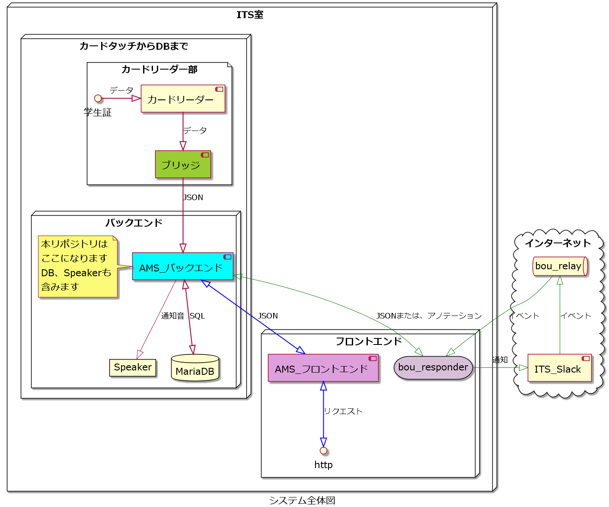

# ams-backend

本リポジトリはこのような立ち位置になっています。

---

## 関係のあるリポジトリ一覧

## 議論したり、作業の優先順位を付けるリポジトリ

[ams-project](https://github.com/su-its/ams-project)

---

## カードリーダー部

[カードリーダー部のブリッジ](https://github.com/su-its/rdr-bridge)

---

## フロントエンド部

[AMS_フロントエンド](https://github.com/su-its/ams-frontend)

---

## レスポンスを受け取るリポジトリ

[bou_responder](https://github.com/su-its/bou-responder)

---

## API の動作はこちらに記載しています

### OpenAPI で記載しています

[API を OpenAPI で書いたもの](docs/OpenAPI/redoc-static.html)
