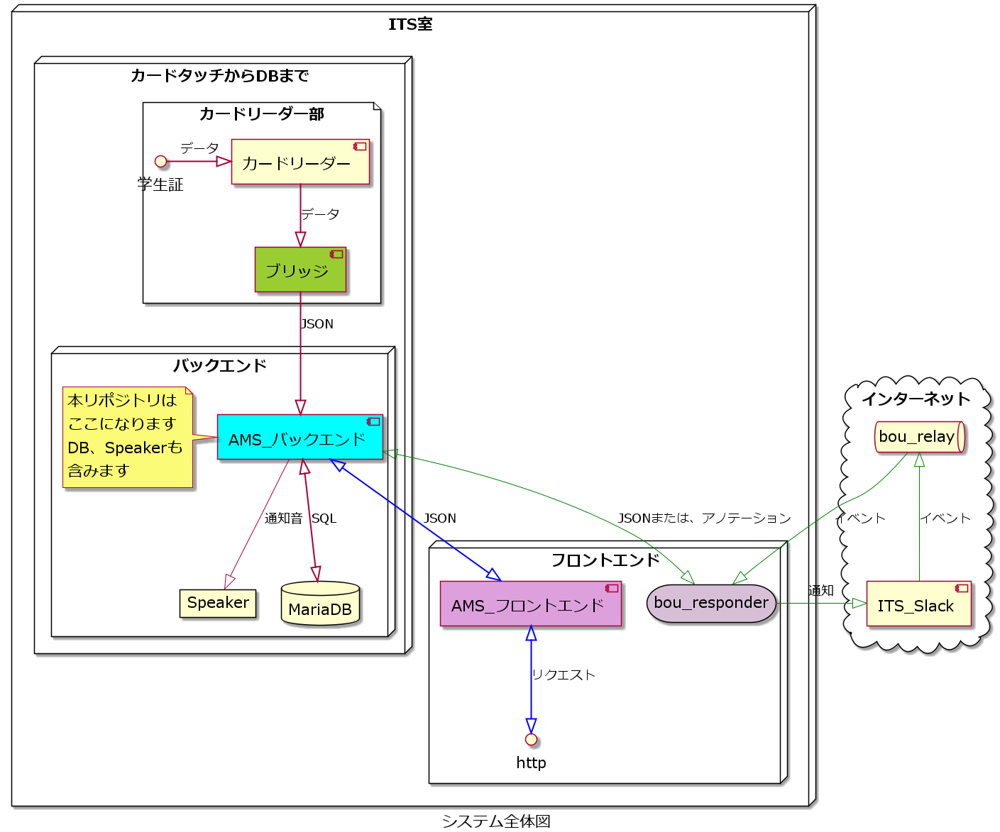

# ams-backend-nodejs

本リポジトリはこのような立ち位置になっています。

---

## 関係のあるリポジトリ一覧

## 議論したり、作業の優先順位を付けるリポジトリ

[ams-project](https://github.com/su-its/ams-project)

---

### カードリーダ部

[カードリーダ部のブリッジ](https://github.com/su-its/rdr-bridge)

---

### フロンドエンド部

[AMS_フロントエンド](https://github.com/su-its/ams-frontend)

---

#### レスポンスを受け取るリポジトリ

[bou_responder](https://github.com/su-its/bou-responder)

---

## APIの動作はこちらに記載しています

### OpenAPIで記載しています

[APIをOpenAPIで書いたもの](docs/OpenAPI/redoc-static.html)
